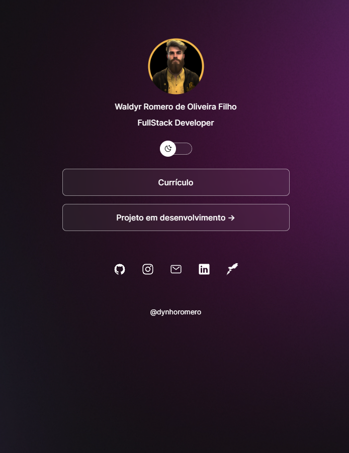

<h1 align="center"> DevLinks </h1>

  

  <a href="#-project">Project</a>&nbsp;&nbsp;&nbsp;|&nbsp;&nbsp;&nbsp;
  <a href="#-technologies">Technologies</a>&nbsp;&nbsp;&nbsp;

## Preview
https://

## 💻 Project

Main page of your personal Links

## :rocket: Technologies

This project was developed with the following technologies:

- HTML e CSS
- JavaScript
- Figma

From your command line:

---

Made by Waldyr Filho :wave: [Get in touch!](https://www.linkedin.com/in/waldyr-romero-de-oliveira-filho-357bb013a/)